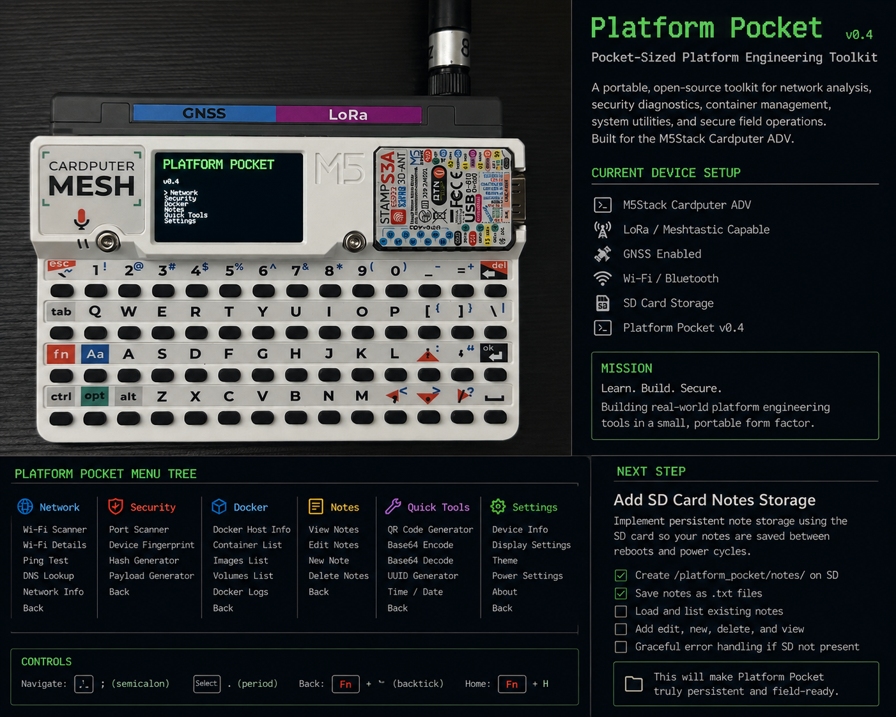

> [!IMPORTANT]
> **Proprietary software — copying prohibited.** This source is public for portfolio review and evaluation only. Copying, modification, redistribution, commercial use, rehosting, derivative works, and AI/ML training use are prohibited without prior written permission. See [LICENSE](LICENSE).

# ⚡ Platform Pocket

> A pocket-sized ESP32-S3 platform engineering toolkit for networking, security diagnostics, Docker reference tools, a local command console, notes, and system utilities — built for the M5Stack Cardputer ADV.

Platform Pocket turns the Cardputer ADV into a compact handheld companion for **networking, embedded C++, platform engineering, security diagnostics, and systems work**.

The v0.5 refresh focuses on making the device feel like a real product instead of a firmware demo: a compact dashboard UI, consistent screen chrome, cleaner Wi-Fi views, live themes and brightness controls, and a keyboard-driven local terminal.

<p align="center">
  
</p>

---

## 📚 Learn How It Works

The detailed learning notes now live in [`/docs`](docs/README.md), so the firmware can stay readable without losing the explanations behind it.

Recommended order:

1. [`docs/architecture.md`](docs/architecture.md) — state machine, menus, routing, data vs. state, and the full input-to-display flow
2. [`docs/ui-and-input.md`](docs/ui-and-input.md) — 240×135 drawing, themes, keyboard events, `KeysState`, and screen ownership
3. [`docs/terminal.md`](docs/terminal.md) — how the local REPL works and how future SSH can fit into the same terminal UI
4. [`docs/adding-a-tool.md`](docs/adding-a-tool.md) — step-by-step examples for adding static and interactive features
5. [`docs/build-and-debug.md`](docs/build-and-debug.md) — PlatformIO, flashing, serial debugging, hardware validation, and debugging the state machine

The docs are meant to be read alongside `src/main.cpp`: learn the concept in `/docs`, then find the real implementation in the firmware.

---

## ✨ v0.5 Highlights

- Redesigned 240×135 handheld UI
- Compact status/header/footer system
- Filled selection panels instead of plain `>` text menus
- First-class **Terminal** screen
- Real Cardputer keyboard text entry
- Local command parser with useful platform/network commands
- Cleaner Wi-Fi scan results and network detail cards
- Interactive brightness control
- Three live UI themes:
  - Midnight Cyan
  - Matrix Green
  - Amber Ops
- Input handling now uses Cardputer keyboard change events to prevent repeated held-key input

---

## 🧭 Main Menu

```text
PLATFORM POCKET

Network
 ├─ Wi-Fi Scanner
 ├─ Wi-Fi Info
 ├─ Signal Monitor
 ├─ DNS Lookup
 └─ Network Tools

Security
 ├─ Security Dashboard
 ├─ Wi-Fi Observations
 ├─ Device Info
 ├─ Hash Tool
 └─ Port Check

Docker
 ├─ Docker Commands
 ├─ Container Cheatsheet
 ├─ Compose Cheatsheet
 └─ Remote Host

Terminal
 └─ Local Platform Pocket shell

Notes
 ├─ View Notes
 ├─ New Note
 ├─ Delete Note
 └─ SD Storage

Tools
 ├─ IP Tools
 ├─ Subnet Helper
 ├─ Base Converter
 ├─ Password Generator
 └─ System Info

Settings
 ├─ Brightness
 ├─ Theme
 ├─ Wi-Fi Settings
 ├─ Storage
 └─ About
```

---

## 🖥️ Local Terminal

Terminal is now a real interactive screen using the Cardputer keyboard.

Example:

```text
TERMINAL                         LOCAL

Platform Pocket v0.5
local command console ready
type help for commands

pocket> scan
```

### Commands

| Command | Action |
|---|---|
| `help` | Show available commands |
| `clear` / `cls` | Clear terminal output |
| `wifi` | Show connection and signal information |
| `scan` | Scan nearby Wi-Fi networks |
| `ip` | Show local IP and gateway |
| `sysinfo` / `free` | CPU, heap, and flash information |
| `uptime` | Show device uptime |
| `docker` | Quick Docker / Compose reference |
| `history` | Show recent command information |
| `version` | Show Platform Pocket version |
| `echo TEXT` | Print text back to the console |
| `ssh` | Reserved for the upcoming remote SSH transport |

The local console is intentionally separate from Linux/Bash. The ESP32-S3 is not itself a Linux machine. A real remote SSH client is a future transport layer so Platform Pocket can become a pocket terminal for Linux hosts.

---

## 📡 Network Features

- Nearby Wi-Fi scanning
- Signal strength (RSSI)
- Channel display
- Open-network detection
- Duplicate SSID observations
- Hidden SSID handling
- Per-network detail view
- Local Wi-Fi / MAC information
- Terminal-based `scan`, `wifi`, and `ip` commands

---

## 🛡️ Security Features

- Passive Wi-Fi observation dashboard
- Open / hidden / duplicate SSID summaries
- Device information
- Defensive wording: scan observations are not treated as proof of malicious activity
- Hashing and authorized host port checks remain on the roadmap

---

## 🐳 Docker Tools

- Docker command reference
- Container concepts cheatsheet
- Docker Compose cheatsheet
- Docker shortcuts inside the local terminal
- Remote Linux / Docker host control planned for a later release

---

## 🎨 UI + Settings

### Themes

Platform Pocket v0.5 includes three live themes:

- **Midnight Cyan** — default dark ops UI
- **Matrix Green** — classic terminal look
- **Amber Ops** — warm retro terminal palette

Choose **Settings → Theme** and press `Enter` to cycle themes.

### Brightness

Choose **Settings → Brightness** and adjust the display live with `;` and `.`.

---

## 🎮 Controls

| Key | Action |
|---|---|
| `;` | Move up / decrease brightness |
| `.` | Move down / increase brightness |
| `Enter` | Select, open, or execute terminal command |
| `Backspace / Del` | Edit terminal input |
| `Fn + \`` | Back / Escape |

Terminal typing uses the Cardputer keyboard's native `KeysState.word`, delete/backspace, Enter, and Escape handling.

---

## 🏗️ Architecture

Platform Pocket uses a state-machine style UI:

```text
Cardputer keyboard
       ↓
Keyboard change event
       ↓
     loop()
       ↓
 ScreenState router
       ↓
┌───────────────┬─────────────┬──────────────┐
│ menu screens  │ tool pages  │ terminal     │
└───────────────┴─────────────┴──────────────┘
       ↓
M5Cardputer display
```

Readable states include:

```cpp
SCREEN_MAIN
SCREEN_SECTION_MENU
SCREEN_WIFI_SCAN
SCREEN_WIFI_DETAILS
SCREEN_TERMINAL
SCREEN_BRIGHTNESS
SCREEN_THEME
```

For the detailed walkthrough, see [`docs/architecture.md`](docs/architecture.md).

---

## 🧰 Hardware

Primary target:

- **M5Stack Cardputer ADV**
- ESP32-S3
- Built-in physical keyboard
- 240×135 display
- Wi-Fi
- SD-card expansion
- GNSS / LoRa-capable expansion hardware

---

## 🛠️ Development Stack

- C++
- Arduino framework
- PlatformIO
- M5Cardputer / M5Unified / M5GFX
- VS Code
- Git + GitHub

---

## 🚀 Build

```bash
pio run
```

Upload to the configured Cardputer ADV:

```bash
pio run --target upload
```

Serial monitor:

```bash
pio device monitor
```

The current `platformio.ini` targets the ESP32-S3 Cardputer ADV environment. See [`docs/build-and-debug.md`](docs/build-and-debug.md) for the complete workflow and debugging guide.

---

## 🗺️ Roadmap

### Next

- Real remote SSH transport
- Saved Wi-Fi profiles
- SD-backed notes + note editor
- Live RSSI signal graph
- DNS lookup with keyboard entry

### Later

- SHA-256 hashing
- Authorized-host port diagnostics
- Subnet calculator
- Decimal / binary / hex converter
- Saved remote hosts
- Better storage manager
- Optional LoRa / GNSS integrations

---

## ⚠️ Security Philosophy

Platform Pocket is designed for **learning, diagnostics, and systems you own or are authorized to administer**.

Wireless scan information is presented as observations. Duplicate names, open networks, hidden SSIDs, or unusual signal levels alone are not treated as proof that a network is malicious.

---

## 📌 Status

**Platform Pocket v0.5 is an active development build.**

The redesigned UI and local terminal are implemented. Hardware flashing/testing on the target Cardputer ADV is the next validation step before merging the refresh into `main`.
